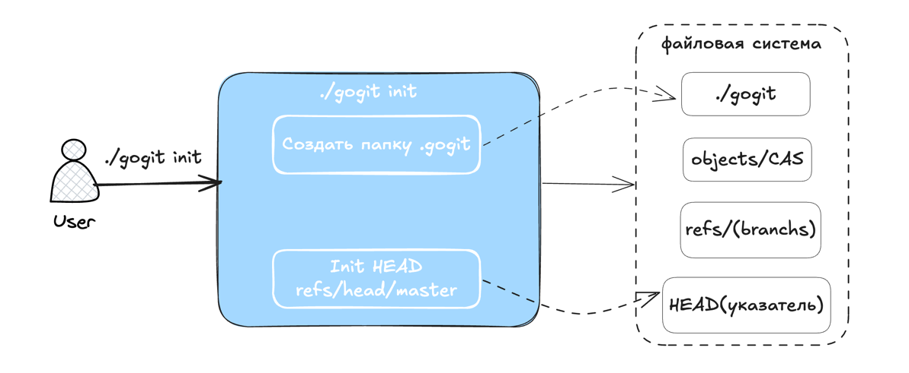
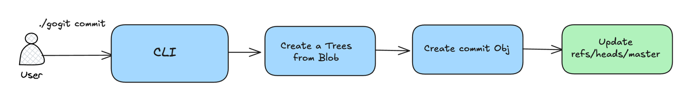
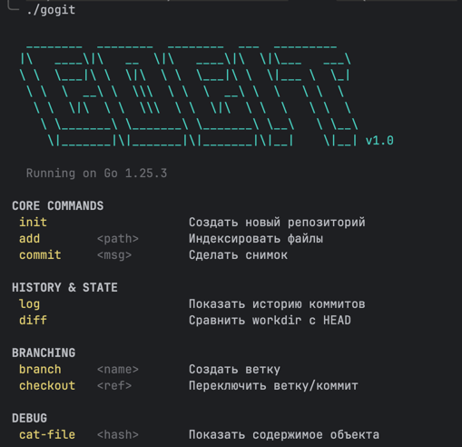
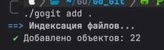
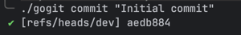
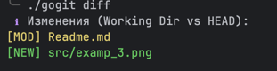
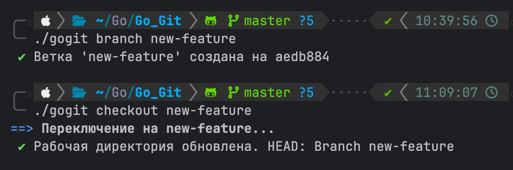

# Git на Go
[!лицензия](LICENSE.md)

>[!INFO]
> Данный проект - системы контроля версий *gogit*, написанная на Go. Проект реализует концепцию 
> **Content-Addressable Storage** (CAS), где имя файла определяется хешем его содержимого.

1.  **Checkout (`checkout.go`):** Это самая опасная команда. Она берет дерево коммита и **перезаписывает**
    файлы на диске. В моей реализации она рекурсивно проходит по объекту `tree`. Если это `blob`, она пишет файл,
    если `tree` — создает папку.

2.  **Diff (`diff.go`):** Настоящий Git сравнивает *Index* (Staging Area) с рабочей директорией.
    Поскольку у нас упрощенный Index (мы сразу пишем объекты при `add`), я реализовал сравнение *HEAD Tree* vs
    *Working Directory*. Это позволяет увидеть, что поменялось с последнего коммита.

3.  **Ignore (`ignore.go`):** Использует простой `glob` матчинг. Я использовал `iter.Seq`
    (паттерн итераторов Go 1.23) внутри логики пакета (в данном примере скрыто внутри `filepath.Walk`,
    но структура пакета готова к расширению на стриминг файлов).

## Струкура проекта

```text
gogit/
├── go.mod
├── main.go               # Точка входа 
└── pkg/
    ├── ui/               # CLI UI
    ├── objects/          # Ядро: Blob, Tree, Commit, zlib сжатие/чтение
    ├── refs/             # Управление ветками и HEAD
    ├── ignore/           # Парсер .gitignore (использует итераторы Go 1.23)
    └── commands/         # Реализация команд
```






## Запуск

```shell
go build -o gogit main.go
```

## Git Clone

```shell
git clone https://github.com/golkity/Git_on_Go.git
```

## Пример команды и вывод

>[!TIP]
> ```shell
> ./gogit
> ```
> 

>[!TIP]
> Создаем файлы и сразу игнорим их
> ```shell
> echo "ignored.txt" > .gitignore
> echo "secret" > ignored.txt
> echo "Hello Git" > hello.txt
> ```
> 
> Начинаем отслежить все файлы $\rightarrow$ проверка на **ignore**
> ```shell
> ./gogit add .
> ```
> 

 
>[!TIP]
> Коммитим новые файлы
> ```shell
> ./gogit commit "Initial commit"
> ```
> 
> 

>[!TIP]
> Изменения
> ```shell
> echo "Update" >> hello.txt
> ./gogit diff
> ```
> 
> 

>[!TIP]
> ```shell
>./gogit branch new-feature
>./gogit checkout new-feature
>```
> 

----
**by Finnik**